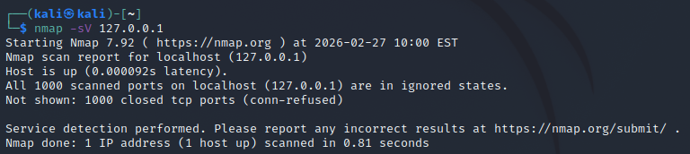
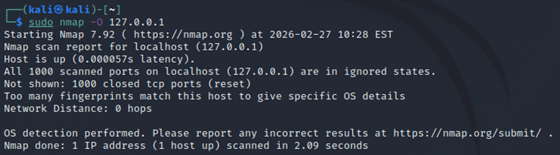
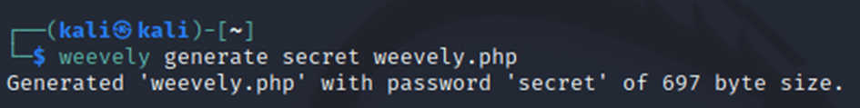
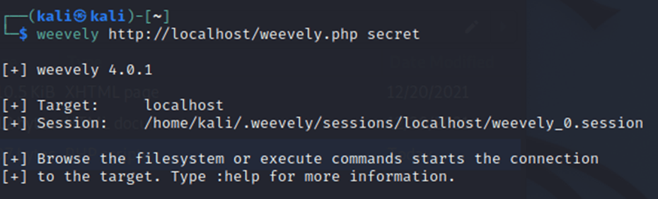
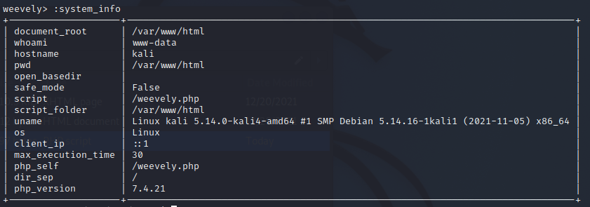

# Assignment 1 — Reconnaissance & Maintaining Access Tools

This assignment demonstrates the use of several Kali Linux tools for performing **reconnaissance** and **maintaining access** in a controlled, ethical environment.  
All commands and tests were executed on **local, safe targets only** such as `127.0.0.1` and `example.com`.

---

# Disclaimer
This project is strictly for **educational purposes only**.  
All testing was performed in a **controlled environment**, using **authorized targets**.  
No real-world systems, networks, or third-party IP addresses were targeted.

---

## Task 1 — Reconnaissance
Reconnaissance tools are used to collect information about a target before attempting any form of exploitation. In this task, **Nmap** was tested. Nmap is a widely-used network scanning tool for discovering hosts, ports, and services on a network.

### 1. Host Discovery (Ping Scan)
  
This feature identifies which devices are currently online without performing a heavy port scan, allowing for a faster and stealthier initial map of the target network.

### 2. Service and Version Detection
  
This scan gathers the version information for each open service to determine if the service is outdated or contains known vulnerabilities.

### 3. OS Fingerprinting
  
This command is used to identify the operating system (like Windows, Linux, or macOS) of a target device by analysing its unique network behaviour.

---

## Task 2 — Maintaining Access
The Maintaining Access phase is critical for ensuring that a penetration tester can remain inside a target system for an extended period, even if the system is rebooted or the initial vulnerability is patched. For this task, **Weevely** was tested. Weevely is a stealthy PHP web shell used to maintain a persistent, telnet-like connection to a compromised web server.

### 1. Backdoor Agent Generation
  
This creates a small, obfuscated PHP script that acts as the "agent." Its polymorphic nature makes it difficult for antivirus software to detect.

### 2. Remote Terminal Connection
  
This feature establishes a persistent communication channel over HTTP. By tunnelling the shell access through web traffic, it allows the tester to maintain access through firewalls that only allow web traffic, making the session appear as legitimate activity.

### 3. Internal System Enumeration (`:system_info`)
  
This is used to profile the target environment by identifying server configurations, PHP restrictions, and operating system details necessary for further administration or post-exploitation.

---

## Comparison and Conclusion

### Comparison of Tools

| Feature | Nmap (Reconnaissance) | Weevely (Maintaining Access) |
| :--- | :--- | :--- |
| **Primary Goal** | External discovery and mapping of the attack surface | Internal persistence and remote system management |
| **Visibility** | Active scanning can be detected by firewalls | Highly stealthy, obfuscated code to bypass filters |
| **Usage Context** | Used at the very beginning to find a way in | Used after exploitation to stay in |
| **Communication** | Direct network probes (TCP/UDP packets) | Encapsulated commands inside HTTP traffic |

### Conclusion
In this Assignment 1, I learned that both tools are very important for a pen tester. **Nmap** is used first to collect information and find a way into the target. **Weevely** is used later to make sure we do not lose access to the system. Using both tools together allows a tester to plan an attack and then stay in control of the target safely and quietly.
