# Assignment 1 — Reconnaissance & Maintaining Access Tools

This assignment demonstrates the use of several Kali Linux tools for performing **reconnaissance** and **maintaining access** in a controlled, ethical environment.  
All commands and tests were executed on **local, safe targets only** such as `127.0.0.1` and `example.com`.

---

# Disclaimer
This project is strictly for **educational purposes only**.  
All testing was performed in a **controlled environment**, using **authorized targets**.  
No real-world systems, networks, or third-party IP addresses were targeted.

---

## Task 1 — Reconnaissance

Reconnaissance tools are used to collect information about a target before attempting any form of exploitation.

---

## 1. Recon-ng

**Recon-ng** is a reconnaissance framework used to gather information about a target through automated modules, helping identify domains, hosts, and related data.

### 1. Workspace Management
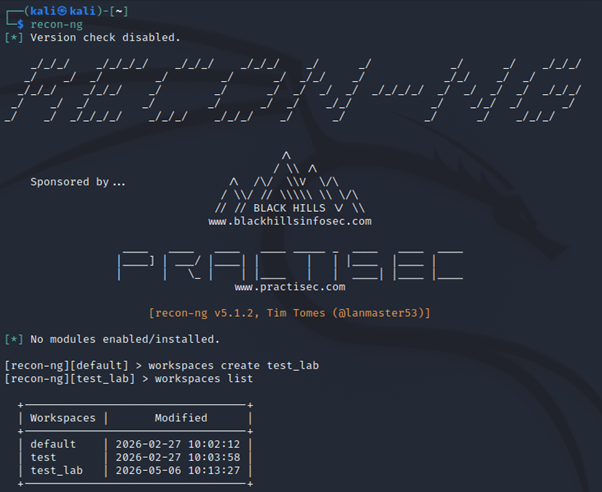  
This feature is used to create and manage separate workspaces for each reconnaissance project.

### 2. Module Marketplace
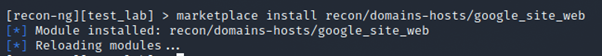  
This command allows users to install, manage, and organize modules within Recon-ng.

### 3. Module Execution (Information Gathering)
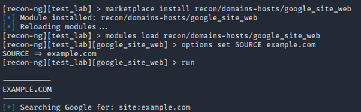  
This feature is used to load and run modules that collect information about a target domain.

---

## 2. Nmap

**Nmap** is a widely-used network scanning tool for discovering hosts, ports, and services on a network.

### 1. Host Discovery (Ping Scan)
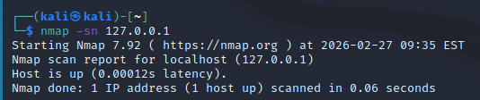  
This feature identifies which devices are currently online without performing a heavy port scan, allowing for a faster and stealthier initial map of the target network.

### 2. Service and Version Detection
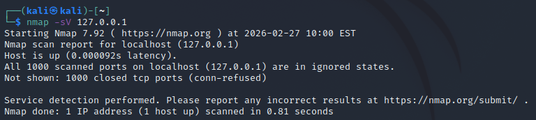  
This scan gathers version information for each open service to determine if the service is outdated or contains known vulnerabilities.

### 3. OS Fingerprinting
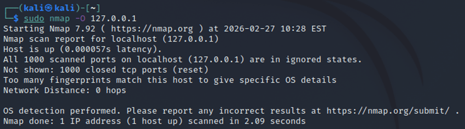  
This command identifies the operating system of a target device by analysing its unique network behaviour.

---

## 3. Hping3

**Hping3** is a network tool used to create and send custom packets for testing firewall rules, network performance, and security.

### 1. TCP SYN Scan
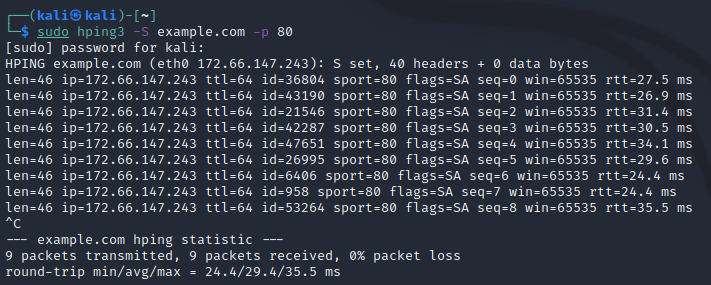  
This command sends TCP SYN packets to a target port to determine whether the port is open.

### 2. ICMP Ping Test
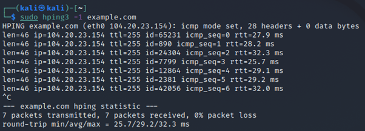  
This feature sends ICMP packets to test whether a host is reachable.

### 3. UDP Scan
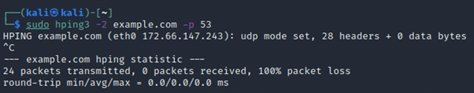  
This feature sends UDP packets to determine if a service is available. UDP may not always respond, which can result in packet loss.

---

## 4. DNSRecon

**DNSRecon** is a tool used to gather DNS information about a domain, including records, subdomains, and name servers.

### 1. DNS Record Enumeration
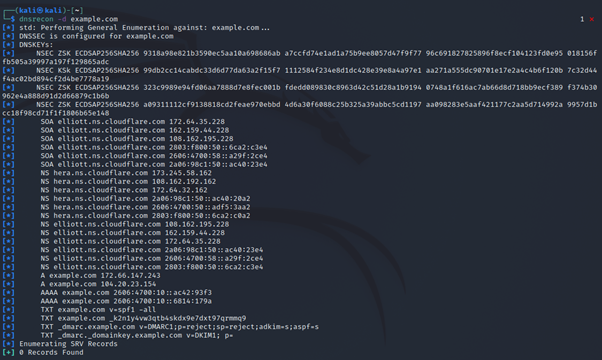  
This feature retrieves standard DNS records such as A, MX, and NS records to identify key information about the target domain.

### 2. Zone Transfer Attempt
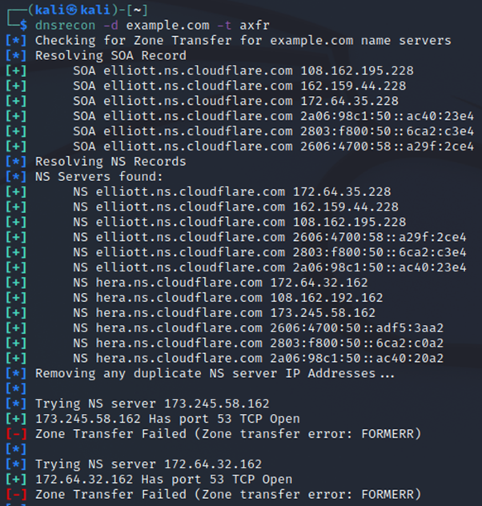  
This feature attempts a DNS zone transfer from the target name server.

### 3. Reverse Lookup
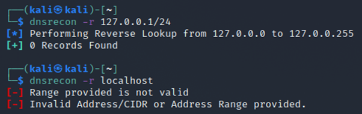  
This feature performs reverse DNS lookups to find domain names linked to IP addresses.

---

# Task 2 — Maintaining Access

Maintaining access ensures that a penetration tester can remain inside a target system for an extended period after initial access has been achieved.

---

## 5. PowerSploit

**PowerSploit** is a Windows-based PowerShell post-exploitation framework used for privilege escalation, credential extraction, and maintaining access.

### 1. Module Loading
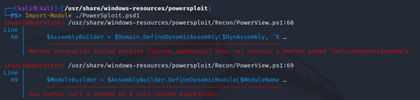  
This feature loads the PowerSploit framework into PowerShell so its modules can be accessed.

### 2. Credential Access
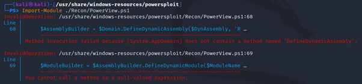  
This command performs reconnaissance on a Windows domain environment.

### 3. Privilege Escalation Module Access
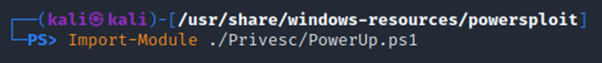  
This feature provides tools to identify privilege escalation opportunities.

> **Note:** PowerSploit does not fully work in Kali Linux because it depends on Windows-specific .NET and PowerShell features.

---

## 6. Webshells

**Webshells** are malicious scripts uploaded to a web server that allow remote command execution through a browser.

### 1. Remote Command Execution
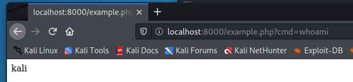  
This feature allows execution of system commands through URL parameters in a browser.

### 2. System Information Retrieval
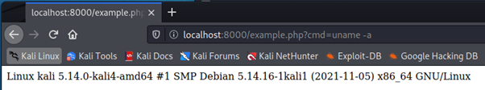  
This feature retrieves operating system information and kernel details.

### 3. File System Interaction
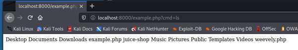  
This feature allows browsing and listing files in the target server directory.

---

## 7. Weevely

**Weevely** is a stealthy PHP web shell used to maintain a persistent connection to a compromised web server.

### 1. Backdoor Agent Generation
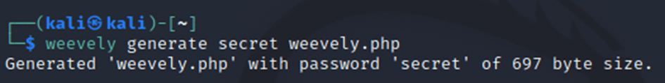  
This creates an obfuscated PHP agent that acts as the backdoor on the target system.

### 2. Remote Terminal Connection
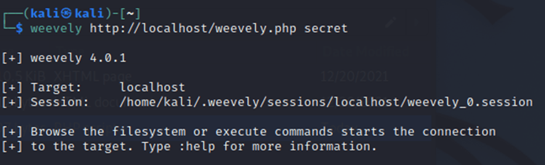  
This feature establishes a persistent remote terminal over HTTP, allowing access through web traffic.

### 3. Internal System Enumeration
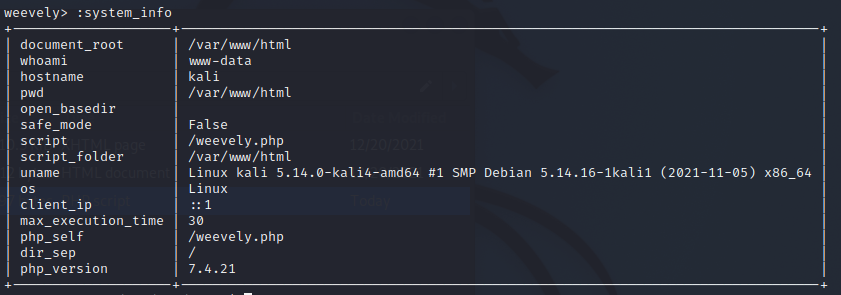  
This feature profiles the target environment by identifying system configuration, PHP restrictions, and operating system details.

---

## 8. Dns2tcp

**Dns2tcp** is a tunneling tool that transfers data through the DNS protocol to bypass firewall restrictions.

### 1. Configuration File Setup
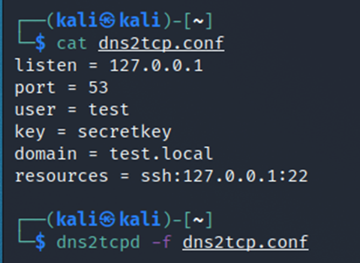  
This configuration defines authentication, domain name, and services available through the DNS tunnel.

### 2. Server Setup (dns2tcpd)
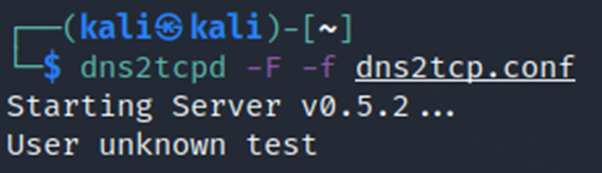  
This command starts the dns2tcp server using the selected configuration file.

### 3. Client Concept
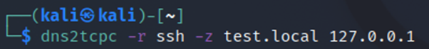  
This feature represents the client-side connection, allowing access to restricted services such as SSH through DNS queries.

---

## 9. Cryptcat

**Cryptcat** is a secure version of Netcat that provides encrypted communication between a client and server.

### 1. Encrypted Listener Setup (Server Side)
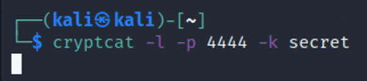  
This feature starts a listening port and waits for encrypted incoming connections using a shared password.

### 2. Remote Connection (Client Side)
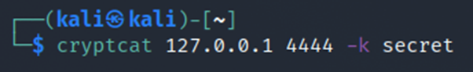  
This feature connects to the listening server through an encrypted channel.

### 3. Encrypted Data Transfer
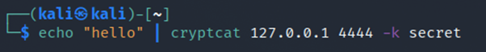  
This demonstrates encrypted transfer of data across the network using a shared encryption key.

---

# Conclusion

These tools cover both the **reconnaissance** and **maintaining access** stages of penetration testing.

| Tool | Purpose | Type | Key Strength |
|------|---------|------|--------------|
| Recon-ng | Information gathering | Reconnaissance | Automated OSINT modules |
| Nmap | Network scanning | Reconnaissance | Fast port and service detection |
| Hping3 | Packet crafting | Network testing | Custom packet control |
| DNSRecon | DNS enumeration | Reconnaissance | DNS and subdomain discovery |
| PowerSploit | Post-exploitation | Windows framework | Privilege escalation tools |
| Webshells | Remote command execution | Post-exploitation | Browser-based control |
| Weevely | Web shell management | Post-exploitation | Lightweight PHP backdoor |
| Dns2tcp | DNS tunneling | Post-exploitation | Firewall bypass through DNS |
| Cryptcat | Secure communication | Post-exploitation | Encrypted data transfer |

In conclusion, the tools used in this assignment cover both **reconnaissance** and **maintaining access** stages of penetration testing. Reconnaissance tools such as **Recon-ng**, **Nmap**, and **DNSRecon** are used to collect information about target systems, while tools like **Webshells**, **Cryptcat**, **dns2tcp**, and **Weevely** focus on maintaining access and enabling remote control. Throughout the practical work, some tools such as **PowerSploit** and **dns2tcp** showed compatibility and configuration challenges in the Kali Linux environment. This highlights that effective penetration testing requires not only tool usage, but also understanding of tool behaviour, troubleshooting skills and system compatibility.
